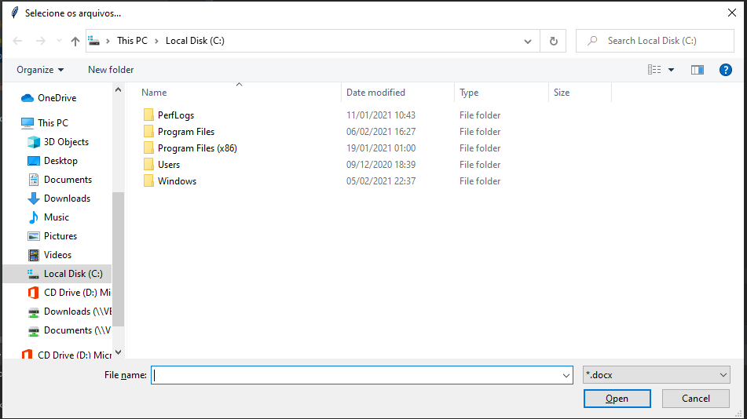
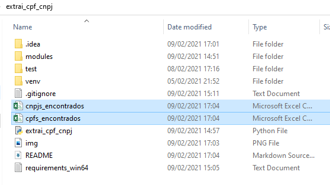

# Extrator de CPFs/CNPJs

Programa para extrair números de CPFs e CNPJs encontrados em documentos (.docx ou .pdf).

Este programa recebe como entrada uma lista de arquivos no formato ".pdf" ou ".docx" re retorna, pesquisa CPFs e CNPJs nos arquivos e retorna os resultados em arquivos ".csv".

Versão desenvolvida e testado no Windows 10.

# Requisitos
    - Python3
Pode ser baixado e instalado em: "https://www.python.org/download/releases/3.0/".

* Certifique-se de adicionar o Python3 ao PATH do windows na instalação.

    - Git
    
Pode ser baixado e instalado em: "https://git-scm.com/downloads".
# Instalação
1 - No prompt de comando (cmd) do Windows, baixar o pacote do programa:

    git clone https://github.com/Gabriel-Nunes/extrai_cpf_cnpj.git
2 - Mover para o diretório do programa: 
    
    cd extrai_cpf_cnpj
3 - Criar um ambiente virtual:
    
    python3 -m venv venv 

ou, se você não tiver outra versão do Python em sua máquina:

    python -m venv venv

4 - Ativar o ambiente virtual:

    venv\Scripts\activate.bat

5 - Instalar as dependências (somente na 1a vez):

    pip3 install -r requirements_win64.txt

# Rodando o programa
    python3 extrai_cpf_cnpj.py
ou, se você não tiver outra versão do Python em sua máquina:

    python extrai_cpf_cnpj.py

Escolher o tipo de arquivo onde estão os CPFs/CNPJs:

    Qual o tipo de arquivo que deseja extrair os CPFs/CNPJs?

        1 - .pdf
        2 - .docx
        3 - sair

        Digite a opcao desejada:

Selecionar os arquivos de origem (devem estar na mesma pasta):

Conferir os arquivos de resultados na mesma pasta do programa.

